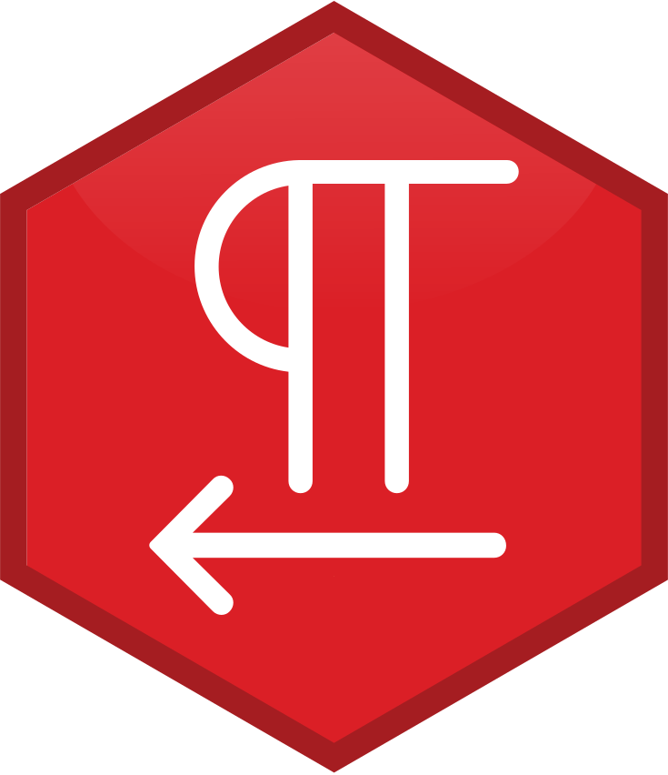

<!-- README.md is generated from README.Rmd. Please edit that file -->

<a href={https://github.com/Ehyaei/MPIThemes}>

# RTLNotes

[](https://github.com/Ehyaei/RTLNotes/actions)
[](https://github.com/Ehyaei/RTLNotes)
[](https://lifecycle.r-lib.org/articles/stages.html#experimental)
[](https://github.com/Ehyaei/RTLNotes/commits/main)

RMarkdown enables you to write reproducible academic publications such
as articles, PhD thesis, lab reports, posters, presentations, and a
variety of other fascinating documents using the lightweight and
plain-text Markdown syntax.

In the Rmarkdown environment, you can write text, insert images,
formulas and simultaneously R and Python scripts.

> RTLNotes is not only for R users!. Python programmers can also run
> codes in Rmarkdown. This
> [article](https://ehyaei.github.io/MPIThemes/articles/articles/21_python_rmarkdown.html)
> has additional information.

When running your Rmd files with knitr, output plots, tables and code
results are embedded in the md file. Then, Rstudio by using pandoc’s
powerful engine can convert your documents to many formats, such as PDF,
Docx, HTML, epub, and… In particular, you can create PDF reports without
worrying about the lateX code.

<p align="center">

</p>

# Features

The `RTLNotes` package contains report and presentation templates in
PDF, HTML, Office formats. In the articles area, you’ll find an
introduction to each template as well as instructions on how to config
it. The templates that have been implemented so far are as follows:

-   [PDF Report (LaTeX)]()
-   [Short PDF note (LaTeX)]()
-   [Long Document (Gitbook/Bookdown)]()
-   [Beamer Presentation (LaTeX)]()

The template’ default format is based on the Maxi-Planck theme. We
weren’t, however, constrained by this theme. Reports in various styles
can be created by defining the relevant parameters in YAML or templates.
for more details see [PDF Report Template
Customization](https://ehyaei.github.io/MPIThemes/articles/articles/pdf_report_template_customization.html)

## Installation

`RTLNotes` is not (yet) available on CRAN, so install development
version from GitHub via the `devtools` or `remotes` packages.

``` r
# install.packages("devtools")
devtools::install_github("Ehyaei/RTLNotes")
```

For find more details of package dependencies, you can see [Get
Started](https://ehyaei.github.io/RTLNotes/articles/articles/RTLNotes.html).

## Attribution

The RMarkdown packages and latex resources that inspired this effort
include:

-   Ahmad Ehyaei’s [MPIThemes](https://ehyaei.github.io/MPIThemes/)
