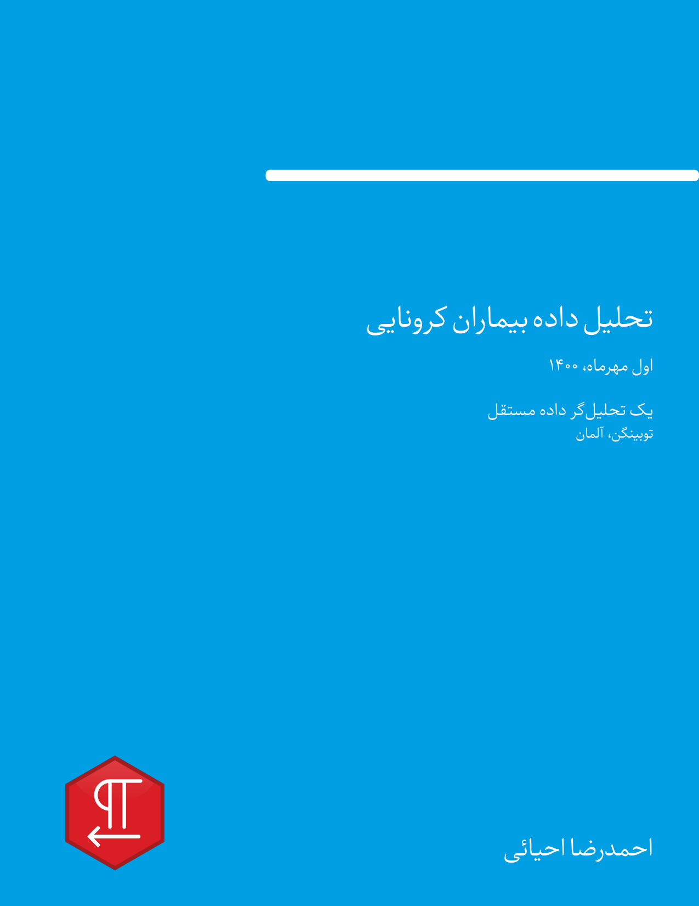
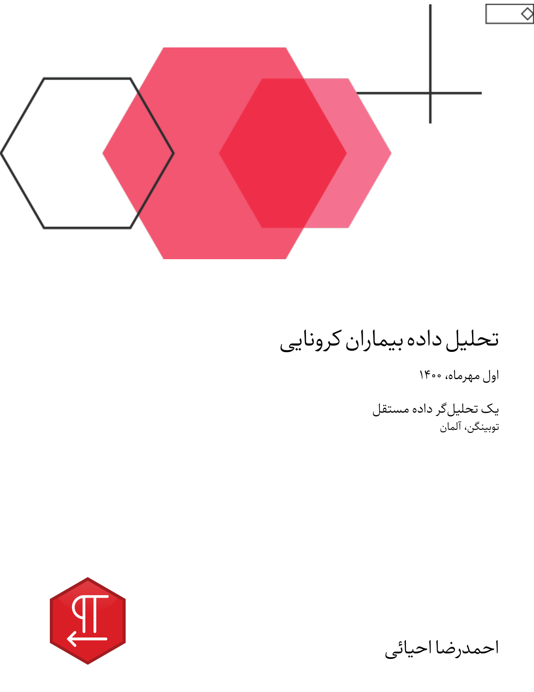
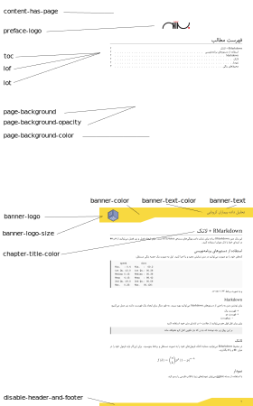

```{r, include = FALSE}
knitr::opts_chunk$set(
  collapse = TRUE,
  comment = "#>"
)
```

You can use the YAML configuration at the top of the Rmd to customize the template's output.
For designing the title page, chapters, and colors, there are design options that are listed below.
Also pandoc default template YAML options are available; for additional information, see the [the pandoc manual](https://pandoc.org/MANUAL.html#variables-for-latex).
All of the parameters are optional. The template is also running if it doesn't fill in.
Before explaining the options, a few examples of title page designs are given.
For more details, click on the image and see the full document for each example.

<table width="100%" border="0">
  <tr>
  <td>
  <a href="https://github.com/Ehyaei/MPIThemes/tree/master/examples/basic_pdf_report">
  
  </a></td>
  <td>
  <a href="https://github.com/Ehyaei/MPIThemes/tree/master/examples/titlepage_bottom_background_pdf_report">
  
  </a></td>
  <td>
  <a href="https://github.com/Ehyaei/MPIThemes/tree/master/examples/titlepage_background_pdf_report">
  
  </a></td>
  </tr>
  <tr>    
  <td>
  <a href="https://github.com/Ehyaei/MPIThemes/tree/master/examples/titlepageـcolorـpdf_report">
  
  </a></td>
  <td>
  <a href="https://github.com/Ehyaei/MPIThemes/tree/master/examples/titlepage_top_background_pdf_report">
  
  </a></td>
  <td>
  <a href="https://github.com/Ehyaei/MPIThemes/tree/master/examples/two_color_pdf_report">
  
  </a></td>
  </tr>
</table>


## Title Page

Options for designing the title page are listed below:

- `titlepage`: When true, the title page is displayed. The default value is false.
- `title`: The main title of your document.
- `subtitle`: The subtitle of the document. 
- `author`: Set the name of authors. you can write authors name in list like `["Ahmad","Sara"]`
- `date`: The report's publication date. It generated automatically from system time by default.
- `affiliation`: Relates to the name of the organization or entity of the person producing the report.
- `location`: City or location of organization.
- `titlepage-text-color`: Hex color code without # for the title page text without an author.
- `title-vjust`: An integer number used to determine the vertical position of the first page's title text. This value is somewhere between -200 and 200. This number changes depending on the document. It takes some trial and error to find its exact placement.
- `title-hjust`: An integer number used to determine the horizontal position of the first page's title text like as `title-vjust`.
- `titlepage-author-text-color`: Hex color code without # for the author in title page.
- `author-vjust`: An integer number used to determine the vertical position of the first page's author text like as `title-vjust`.
- `author-hjust`: An integer number used to determine the horizontal position of the first page's author text like as `title-vjust`.
- `titlepage-color`: The color of the title page's background The color value must be specified in HTML hex format, such as D8DE2C, without the leading number sign (#). It's best to put color it in quotes, such as "D8DE2C".
- `titlepage-top-color`: The color of the top title page's background.
- `titlepage-bottom-color`: The color of the bottom title page's background.
- `titlepage-rule-color`: The rule's color at the top of the title page.
- `titlepage-rule-height`: The rule's height at the top of the title page.
- `titlepage-twocolor-rule`: It is a Boolean variable. If set to true, then add the rule line between the top and bottom parts.
- `titlepage-twocolor-rule-height`: The rule's height of two color rule.
- `titlepage-background`: The path to a title page background image The background image has been resized to fill the entire page.
- `titlepage-top-background`: The path to a top title page background.
- `titlepage-bottom-background`: The path to a bottom title page background.
- `logo-primary`: The path to the main logo is at the top of the title page.
- `logo-primary-size`: The numeric value between 0 to 1, related to height of logo. 
- `logo-secondary`: The path to the second logo is at the bottom of the title page.
- `logo-secondary-size`: The numeric value between 0 to 1, related to height of logo.

<p align="center">

</p>


## Section Page

To make the report more beautiful, some configurations have been considered for the internal pages, 
the explanations are given below:

- `content-has-page`:  If true, then begin a new page after the table of contents, tables, and figures.
- `preface-logo`: The path logo or small image in top a table of contents.
- `toc`: The Boolean variable, if true, shows the table of contents. 
- `lof`: The Boolean variable, if true, shows the list of figures.
- `lot`: The Boolean variable, if true, shows the list of tables.
- `disable-header-and-footer`: On all pages, the header and footer are disabled. False is the default setting.
- `page-background`: The path to a background image for any page. The background image has been stretched to fill the entire page.
- `page-background-opacity`: The background image opacity.
- `page-background-color`: Hex color code to fill to a background image for any page.
- `banner-color`:  Hex color code to fill to a banner on header of any page.
- `banner-logo`: The path to a banner image that is located in the top right.
- `banner-logo-size`: The numeric value between 0 to 1, related to height of logo.
- `banner-text`: The text to a banner image that is shown in the top left.
- `banner-text-color`: Hex color code for banner-text
- `chapter-title-color`: Hex color code for chapter title

<p align="center">

</p>

This example was generated by below YAML configuration. For more details
see example [interior page design](https://github.com/Ehyaei/MPIThemes/tree/master/examples/interior_feature_pdf_report).

```
---
title: "Statistical analysis of behavioral data"
date: "`r format(Sys.time(), '%d %B, %Y')`"
author: [Ahmad Ehyaei, Sara Ershadmanesh]
affiliation: Max Planck Institute for Biological Cybernetics 
location: Tübingen
titlepage: true
toc: true
content-has-page: true
logo-primary: src/icon/MPILogoGray.eps
logo-secondary: src/icon/MPIBCWhite.eps
preface-logo: src/icon/MPIBCNNBlack.eps
page-background-color: f6f6f6
banner-color: 009EE2
banner-logo: src/icon/MPIBCNNWhite.eps
banner-text: Max-Planck Institute
banner-text-color: ffffff
chapter-title-color: E90649
output:
  MPIThemes::latex_report
---
```
