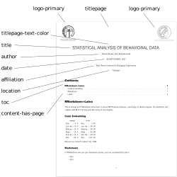
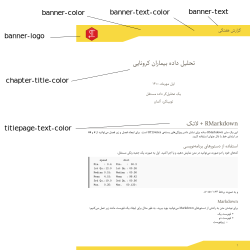

Producing a short PDF report is essentially similar to writing a PDF report, with the exception that there is no title page or table of contents on separate pages. Simply deactivate the titlepage and content-has-page settings to create this report.
For see more features , you can see PDF Report Template Customization article.
Below is an example of a short report with its output displayed and its YAML settings.

```
--- 
title: "Statistical analysis of behavioral data "
date: "`r format(Sys.time(), '%d %B, %Y')`"
author: [Ahmad Ehyaei, Sara Ershadmanesh]
affiliation: Max Planck Institute for Biological Cybernetics 
location: Tübingen
titlepage: false
titlepage-text-color: 000000
toc: true
content-has-page: false
logo-primary: src/icon/MPILogoGray.eps
logo-secondary: src/icon/MPIBCGray.eps

---
```

<p align="center">

</p>

Colors and text may be assigned to the header, footer, and chapters to make the short report more visually appealing. The following is an example of a customized report.

```
--- 
title: "Statistical analysis of behavioral data"
date: "`r format(Sys.time(), '%d %B, %Y')`"
author: [Ahmad Ehyaei, Sara Ershadmanesh]
affiliation: Max Planck Institute for Biological Cybernetics 
location: Tübingen
titlepage-text-color: 009EE2
banner-color: CDC9C4
banner-logo: src/icon/MPIBCNNWhite.png
banner-text: Weekly Report
banner-text-color: ffffff
chapter-title-color: 009EE2
---
```

<p align="center">

</p>

