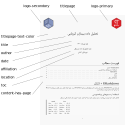

Producing a short PDF report is essentially similar to writing a PDF report, with the exception that there is no title page or table of contents on separate pages. Simply deactivate the titlepage and content-has-page settings to create this report.
For see more features , you can see PDF Report Template Customization article.
Below is an example of a short report with its output displayed and its YAML settings.

```
--- 
title: تحلیل داده بیماران کرونایی
date: اول مهرماه، ۱۴۰۰
author: احمدرضا احیائی
affiliation: یک تحلیل‌گر داده مستقل
location: توبینگن، آلمان
titlepage: false
toc: true
logo-primary: src/icon/RTLNotes.png
logo-secondary: src/icon/RWLogo.png
disable-header-and-footer: true
titlepage-author-text-color: 000000 
titlepage-text-color: 000000
page-background-color: f8f8f8
output:
  RTLNotes::latex_report
---
```

<p align="center">

</p>

Colors and text may be assigned to the header, footer, and chapters to make the short report more visually appealing. The following is an example of a customized report.

```
--- 
title: تحلیل داده بیماران کرونایی
date: اول مهرماه، ۱۴۰۰
author: احمدرضا احیائی
affiliation: یک تحلیل‌گر داده مستقل
location: توبینگن، آلمان
titlepage: false
toc: false
content-has-page: true
titlepage-text-color: 534B3E
banner-color: F8D940
banner-logo: src/icon/RTLNotes.png
banner-text: گزارش هفتگی
banner-text-color: 534B3E
chapter-title-color: 534B3E
output:
  RTLNotes::latex_report
---
```

<p align="center">

</p>

