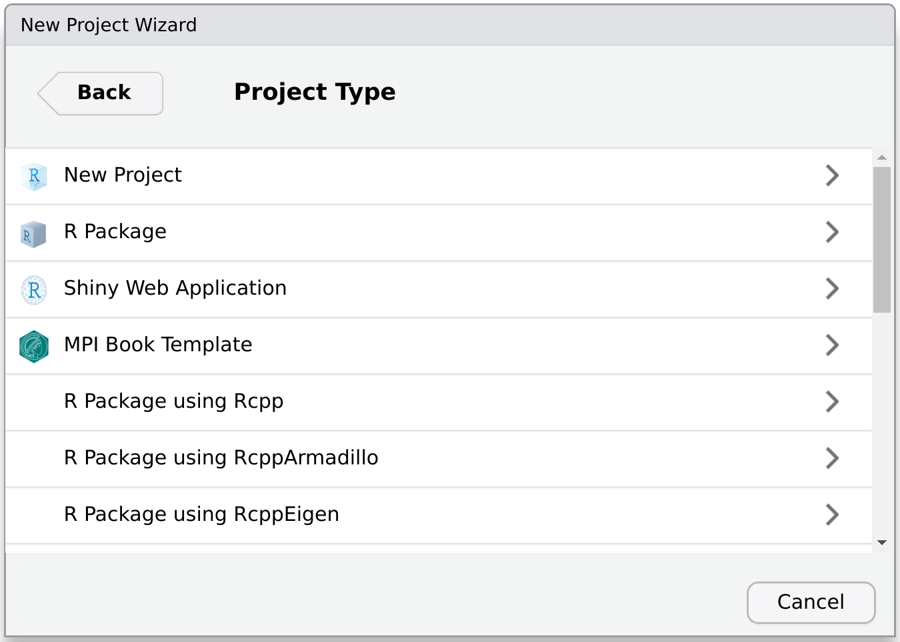
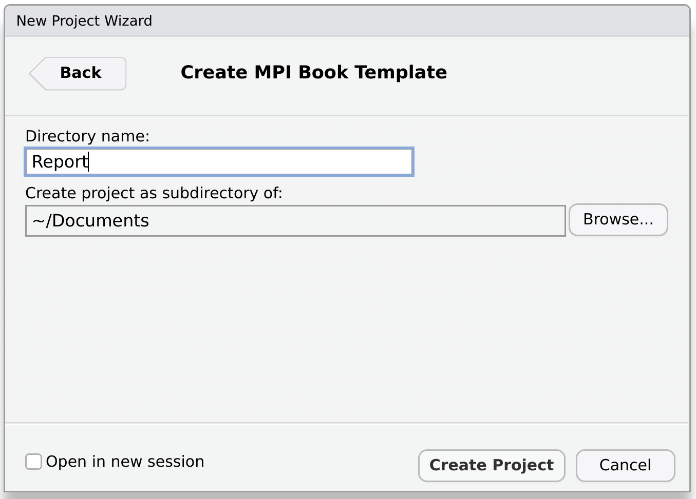
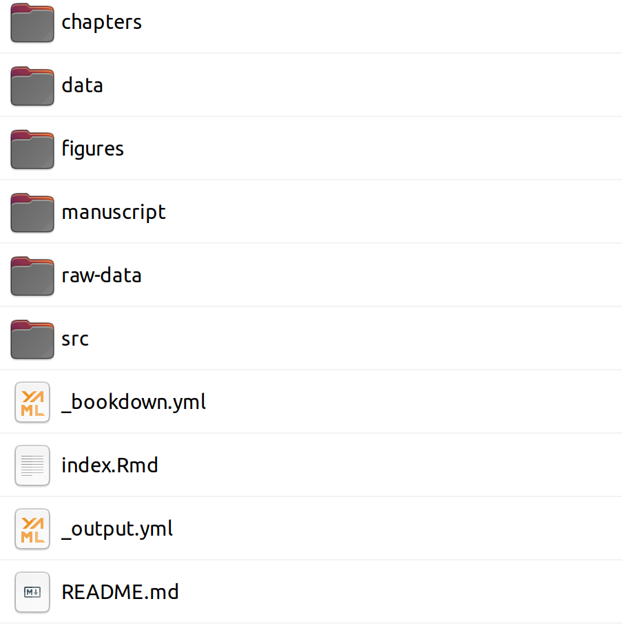
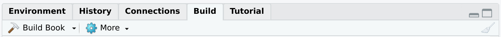
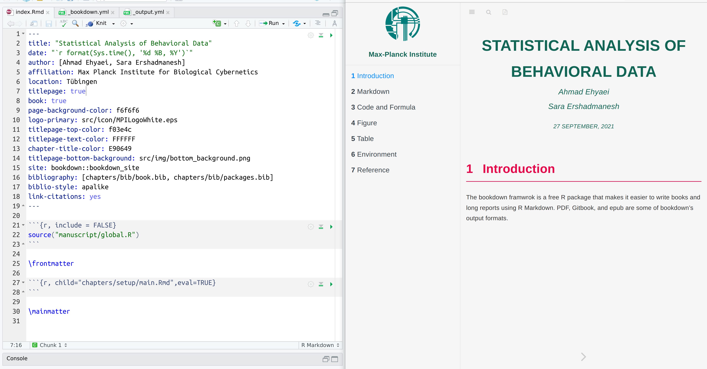

Using the RTLNotes Book Template, you could create complex documents in HTML and PDF.
This template is built using the `bookdown` package. `bookdown`'s primary goal is to generate books and ebooks from R Markdown files, which is simpler than LaTeX.
Another benefit of using this template is that it is well-structured for producing documents with several chapters and handling a big number of files.

To open this template, you first go to `Projects > New Project > New Directory`

<p align="center">

</p>

This will lead you to the list of projects. scrol list and find the RTLNotes Book Template. Click on it.

<p align="center">

</p>

After that, enter the name of the directory and set path and click "Create Project". This will generate a new directory with an.Rproj file and the name you specified in the directory name.

<p align="center">

</p>

After the restart session, a project with the following structure will be opened.

<p align="center">

</p>

Each component of this project is required to set up one of the bookdown's features, which we shall detail below.

1. **index.Rmd**
The primary document information, such as the title, author's name, and data, are entered in this file.You can also use the PDF report features to design a book PDF output format. For more information, you can see
(PDF Report Template Customization)[https://ehyaei.github.io/RTLNotes/articles/articles/01_pdf_report_template_customization.html]
```
--- 
title: تحلیل داده بیماران کرونایی
date: اول مهرماه، ۱۴۰۰
author: احمدرضا احیائی
affiliation: یک تحلیل‌گر داده مستقل
location: توبینگن، آلمان
titlepage: true
book: true
page-background-color: f6f6f6
logo-primary: src/icon/RTLNotes.png
titlepage-top-color: f03e4c
titlepage-text-color: FFFFFF
chapter-title-color: E90649
titlepage-author-text-color: f03e4c
author-vjust: 80
titlepage-bottom-background: src/img/bottom_background.png
site: bookdown::bookdown_site
bibliography: [chapters/bib/book.bib, chapters/bib/packages.bib]
biblio-style: apalike
link-citations: yes
---
```


2. **output.yml**

Output formats can be set in the YAML metadata of the book's initial Rmd file, or in a separate YAML file named "_output.yml." We specified various settings for HTML, PDF, and ePubs. 
`toc-logo` and `toc-title` are related to the logo and tex at the top of the gitbook table of content.
In the following gitbook output parameters.

```
--- 
bookdown::gitbook:
  css:  [src/css/style.css,src/css/environments.css]
  config:
    sharing: null
    info: no
    fontsettings: null
    toc:
      collapse: section
      before: |
        <li class="toc-logo"><a href="./"></a></li>
        <li class="toc-title"><a style="color: #116656;" href="./">Max-Planck Institute</a></li>
      scroll_highlight: yes
    download: ["pdf"]
---
```

In the YAML's PDF part, we set the path of the latex template and other files.

```
--- 
bookdown::pdf_book:
    latex_engine: xelatex
    keep_tex: true
    toc_depth: 5
    pandoc_args:
    - "--top-level-division=chapter"
    - "--wrap=preserve"
    - "--lua-filter=src/tex/template.lua"
    dev: "cairo_pdf"
    template: "src/tex/template.tex"
    includes:
      in_header: "src/tex/preamble.tex"
      before_body: "src/tex/before_body.tex"
      after_body: "src/tex/after_body.tex"
---
```

3. **chapters & bookdown.yml**

This folder contains RMarkdown files. Each of these files is one of the chapters of the book. 
You can set the chapters order with a `_bookdown.yml` file.

```
--- 
book_filename: "Report"
delete_merged_file: true
tables: yes
rmd_files:
  - "index.Rmd"
  - "chapters/Introduction.Rmd"
  - "chapters/Markdown.Rmd"
  - "chapters/Code_Formula.Rmd"
  - "chapters/Figure.Rmd"
  - "chapters/Table.Rmd"
  - "chapters/Environment.Rmd"
  - "chapters/Reference.Rmd"
---
```

We may start the project after inputting the document information and setting the output style by clicking the build button in the rstodio toolbar.

<p align="center">

</p>

We may also use the short key `Shift+Ctrl+B` to do this.
Following the completion of the project, two PDF files and a gateway are created at the same time.
To view the PDF, you can click on the PDF icon at the top of the gitbook.

<p align="center">

</p>
