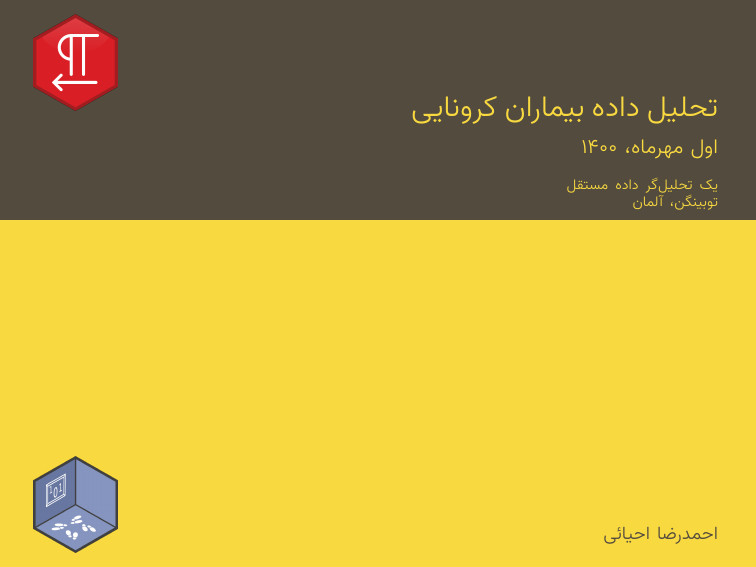
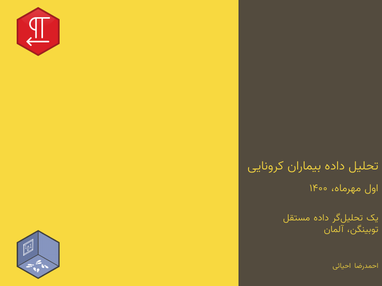
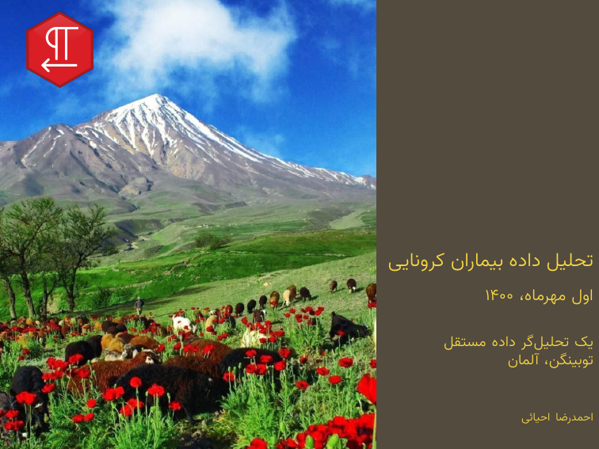
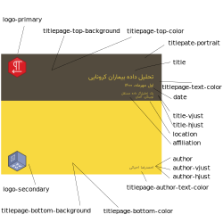
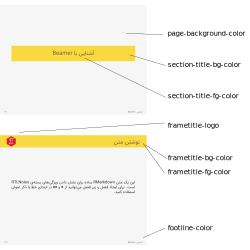

In Latex settings, the **Beamer** is a well-known class for making slides. 
In the *pdf presentation* template, this class was modified with the RTLNotes theme.
To build a presentation from R Markdown, you specify the `latex_presentation` output 
format and configure YAML metadata to use template features.
Using the `#` and `##` heading tags, you may construct a slide show that is divided
into chapters and sections.
Here's an example of YAML and output presentation.

```
--- 
title: "تحلیل داده بیماران کرونایی"
date: "اول مهرماه، ۱۴۰۰"
author: احمدرضا احیائی
affiliation: "یک تحلیل‌گر داده مستقل"
location: "توبینگن، آلمان"
fontsize: 10pt
titlepate-portrait: false
logo-primary: src/icon/RTLNotes.png
logo-secondary: src/icon/RWLogo.png
frametitle-logo: src/icon/RTLNotes.png
output:
  RTLNotes::latex_presentation
---
```

<p align="center">

</p>


The two main features in the presentation are `titlepate-portrait` and `titlepage-bottom-background`.
The titlepage style can be defined in two ways: landscape or portrait, and is controlled by `titlepate-portrait`. You can also put an image in the bottom background by using `titlepage-bottom-background`, as you see in the below examples.
For more details, click on the image and see the full document for each example.

<table width="100%" border="0">
  <tr>    
  <td>
  <a href="https://github.com/Ehyaei/RTLNotes/tree/master/examples/simple_pdf_presentation">
  
  </a>
  </td>
  <td>
  <a href="https://github.com/Ehyaei/RTLNotes/tree/master/examples/simple_portrait_pdf_presentation">
  
  </a>
  </td>
  </tr>
    <tr>    
  <td>
  <a href="https://github.com/Ehyaei/RTLNotes/tree/master/examples/titlepage_bottom_pdf_presentation">
  
  </a>
  </td>
  <td>
  <a href="https://github.com/Ehyaei/RTLNotes/tree/master/examples/basic_pdf_report">
  
  </a>
  </td>
  </tr>
</table>


For best output customization, there are many features for the title page and section pages that are embedded in the template that can be set in YAML configuration.

## Title Page

- `titlepate-portrait`: a Boolean variable that determines the style of the first page to be displayed as either a portrait or a landscape.
- `titlepage-top-color`: Hex color code without # for fill top title page.
- `titlepage-bottom-color`: Hex color code without # for fill bottom title page.
- `titlepage-top-background`: image path for the background of the top title page.
- `titlepage-bottom-background`: image path for the background of the bottom title page.  
- `logo-primary`: image path for the main logo on the top right title page.
- `logo-secondary`: image path for the second logo on the bottom right title page.
- `titlepage-text-color`: Hex color code without # for the title page text without an author.
- `title-vjust`: An integer number used to determine the vertical position of the first page's title text. This value is somewhere between -200 and 200. This number changes depending on the document. It takes some trial and error to find its exact placement.
- `title-hjust`: An integer number used to determine the horizontal position of the first page's title text like as `title-vjust`.
- `titlepage-author-text-color`: Hex color code without # for the author in title page.
- `author-vjust`: An integer number used to determine the vertical position of the first page's author text like as `title-vjust`.
- `author-hjust`: An integer number used to determine the horizontal position of the first page's author text like as `title-vjust`.

<p align="center">

</p>

## Frame Page

- `page-background-color`: Hex color code without # for background of pages.
- `section-title-fg-color`: Hex color code for section title. 
- `section-title-bg-color`: Hex color code for background section title.
- `frametitle-fg-color`: Hex color code for frame title.
- `frametitle-bg-color`: Hex color code for background frame title.
- `frametitle-logo`: image path for the logo on the top right frame title.
- `footline-color`: Hex color code for footline.

<p align="center">

</p>

