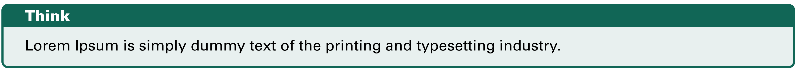
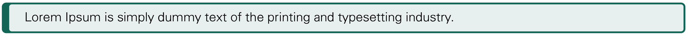
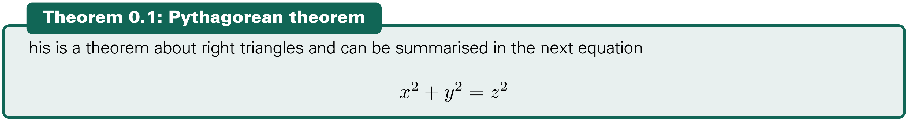
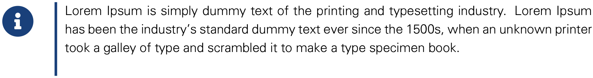
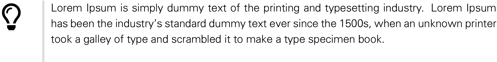
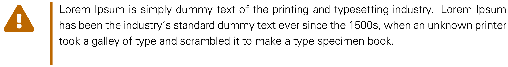
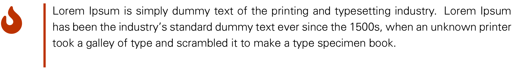

Block content can be useful for informing or alerting your readers about a specific topic.
We use the `awesomebox` and `tcolorbox` Latex packages for colored block content.
For supplemental information, you can use notes, tips, info, error, and warning elements. Each block serves a specific semantic purpose.

# tcolorbox

`tcolorbox` is a well-known latex package that generates a configuration for colored and framed text boxes with a heading line.
Many special colored boxes are designed for the MPIThemes package.
The first part of the boxes is about highlighting the texts in the report.
These environments include:

- rmdThink
- rmdNote
- rmdTip
- rmdWarning
- rmdTodo

The above blocks have two versions, with and without titles. To use the second type, it is sufficient to write the block' name with a small letter like rmdtip.

```markdown
::: {.rmdThink data-latex=""}
Lorem Ipsum ...
:::
```
<p align="center">

</p>

```markdown
::: {.rmdthink data-latex=""}
Lorem Ipsum ...
:::
```
<p align="center">

</p>

The other type of block is related to mathematical writing. 
The list of these blocks includes:

- Theorem
- Definition
- Lemma
- Corollary
- Proposition
- Exercise
- Example
- Remark
- Proof
- Solution

```markdown
:::: {.Theorem data-latex="{Pythagorean theorem}"}
This is a theorem about right triangles and can be summarised in the next 
equation 
\[ x^2 + y^2 = z^2 \]
::::
```
<p align="center">

</p>

# awesomebox

`awesomebox`'s aim is to use `FontAwesome 5` icons to simplify the illustration of these boxes.
Some examples of block environments are shown below.

```markdown
::: {.noteblock data-latex=""}
Lorem Ipsum ...
:::
```

<p align="center">

</p>

```markdown
::: {.tipblock data-latex=""}
Lorem Ipsum ...
:::
```
<p align="center">

</p>


```markdown
::: {.warningblock data-latex=""}
Lorem Ipsum ...
:::
```
<p align="center">

</p>

```markdown
::: {.cautionblock data-latex=""}
Lorem Ipsum ...
:::
```
<p align="center">

</p>


```markdown
::: {.importantblock data-latex=""}
Lorem Ipsum ...
:::
```

<p align="center">

</p>

