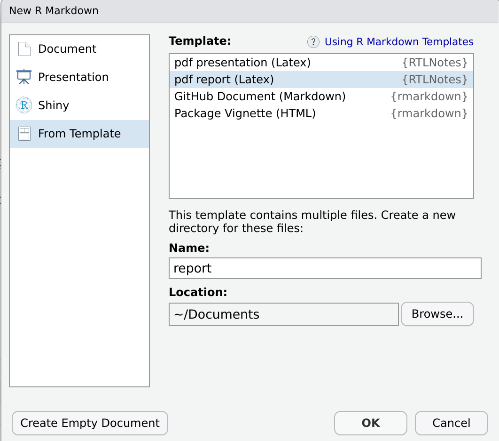
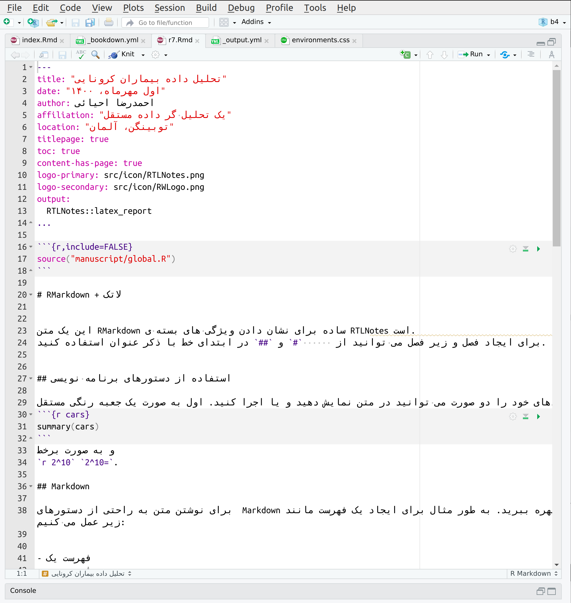

```{r, include = FALSE}
knitr::opts_chunk$set(
  collapse = TRUE,
  comment = "#>",
  results="hide",
  eval = FALSE,
  fig.path = "man/figures/",
  out.width = "100%"
)
```

# Installation

To compile PDF documents with R, you must have Pandoc, LaTeX, and a few other packages installed.

1. **Pandoc**: Pandoc is already installed if you have a recent version of RStudio. 
There's no need to be concerned if you're unfamiliar with [pandoc](https://pandoc.org/).

2. **XeLatex**: The pdf RMarkdown templates compile with XeLatex. You will need to install some version of XeLatex. If you do not have one, there is a simple way in R. [Tinytex](https://yihui.org/tinytex/) is A lightweight LaTeX distribution that is sufficient for compiling pdf templates. To install the tinytex package and a working version of LaTeX run these commands:

``` r
install.packages("tinytex")
tinytex::install_tinytex()
```

The RTLNotes package requires additional LaTeX dependencies that tinytex does not install by default. If you are online, these dependencies will be installed automatically.

3. **Install X11**:  X11 is no longer included with Mac, but X11 server and client libraries are available from the [XQuartz](https://www.xquartz.org/) project. For more information see [CRAN](https://cran.r-project.org/bin/macosx/) instructions. 

4. **Install Fonts**: Before render templates, `Vazir` and `Nahid` fonts must be installed on your machine.
You can find source of fonts in path `src/fonts/` in document template.

5. **RTLNotes**: Install the `RTLNotes` package from GitHub. 
This package is not (yet) available on CRAN.

```r
if(!require(devtools)) install.packages("devtools") 
devtools::install_github("lcreteig/RTLNotes") 
```

After installing the package, you may need to restart RStudio in order to add
new templates to Rstudio.

# Create Report

Follow these simple steps to create the First Report.:

1: In RStudio menu, go to `File > New File > R Markdown > From Template`.

2: Select the `pdf report` template from the list,
Then set the name and directory location and finally click OK.
In a location directory, a Rmd file and a project structure will be created.

<p align="center">

</p>

3: Knit the document by clicking on the Knit icon in the top bar of the Rstudio editor
or its better to use keyboard shortcut for knitr,
`command + Shift + K` on a Mac, or `Ctrl + Shift + K` on Linux and Windows. 

4: Your document will automatically include default YAML headers

```
---
---
title: تحلیل داده بیماران کرونایی
date: اول مهرماه، ۱۴۰۰
author: احمدرضا احیائی
affiliation: یک تحلیل‌گر داده مستقل
location: توبینگن، آلمان
titlepage: true
toc: true
content-has-page: true
logo-primary: src/icon/RTLNotes.png
logo-secondary: src/icon/RWLogo.png
output:
  RTLNotes::latex_report
...

---
```

Fill in these YAML options with your information.
There are plenty of other YAML options; see the [PDF Report Template Customization](https://ehyaei.github.io/RTLNotes/articles/articles/pdf_report_template_customization.html) article.

5: Fill in your report's content. For a pdf template, you can use the markdown command or tex.

<p align="center">

</p>

6: Knit the Rmd file and see result!.

